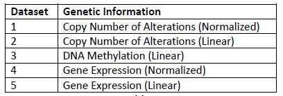
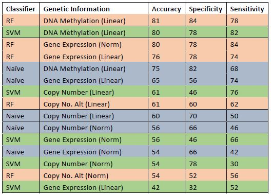

# Prostate Cancer Analysis

This work was developed in collaboration with members of the Bioinfomatics lab at the University of Windsor 
as my final year project for the BCS Honors in Applied Computing program.

This project involved cleaning up data from [CBioPortal](https://www.cbioportal.org/). For our analysis we cleaned up the genetic data for a Prostate Cancer dataset.
We additionally cleaned up the data for Breast Cancer as well. Both datasets are available at the orignal [repo](https://github.com/ferna11i/CBioPortal_Programs) .

The task was to predict the Disease Free Status (DFS) or reoccurance of Prostate Cancer in patients based on their genetic data. 
Five types of genetic data were used for this study as shown below:

We utilized three Machine Learning classiers to evaluate which dataset would provide the best results. As shown in the results table
below Random Forest achieved the highest accuracy

This repo contains a cleanuped code base of the project that was submitted as my final year project.
The important reference files in this project are :
1. *DFS_Analysis.ipynb* : Single python notebook to show the steps taken to train the models. Grid search for hyper parameter tuning
was also performed to improve the performance of the models.
2. *datasets folder* : Contains the csv files of the five genetic datasets for resuability
3. *Final_Report.pdf* : The report which details all the steps and analysis conducted for this project.